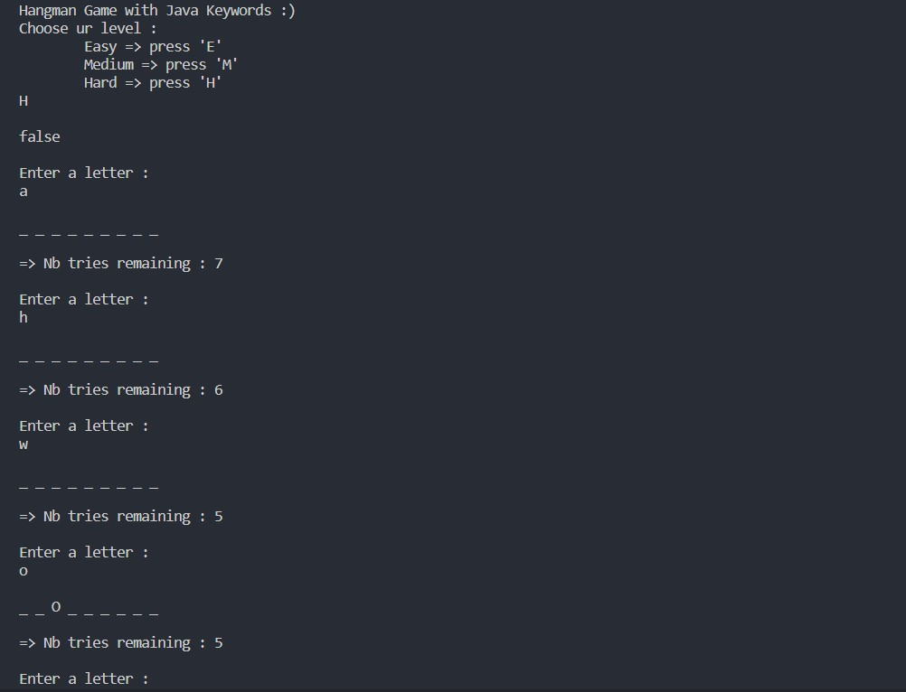

# Project Name
> Hang Man Game with java.
> Live demo [_here_](https://github.com/splach-coder/hangmanGame). 

## Technologies Used
-java language

## Features
NO Feature just a native java.

## Screenshots

## Usage
How does one go about using it?
Provide various use cases and code examples here.

`write-your-code-here`

## Project Status
Project is: _in progress_.
If you are free to add some code feel free working on it.

## Room for Improvement
Include areas you believe need improvement / could be improved. Also add TODOs for future development.

Room for improvement:
- Improvement to be done 1
- Improvement to be done 2

To do:
- Feature to be added 1
- Feature to be added 2

## Acknowledgements
- This project was inspired by the hang man game
- Many thanks to me.

## Contact
Created by [@splash-coder]- feel free to contact me!